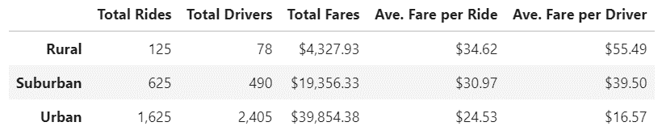

# PyBer_Analysis
UofT Data Analytics Boot Camp Module 05

## Project Overview
Objective
* To provide the analysis of Ride-Sharing Services for different city

Data:
* List of City with Number of drivers (Resources/city_data.csv)
* Details of each ride (Resources/ride_data.csv)

Software: Python 3.7.6, JupyterLab

## Results
#### 1. Summary by Type of City
* Urban Cities has the highest total fares, however, the lowest average fare per city / driver
* Rural Cities has the lowest total fares, however, the highest average fare per city / driver
* In Urban area, the total number of rides is lower than the total number of drivers

#### 2. Fares by Type of City Overtime
* Total fares is higher in larger cities in any period
* No positive or negative trends observed
* Small dip in 1st week of Jan for Urban & Suburban Area

## Summary
PyBer Data implies that;
* In large cities, the users are using PyBer as means for short travels (e.g. grocery shopping, commute etc) but in rural area, the users are using PyBer for longer distance travel
* In large cities, people register for the PyBer service but may never actually use it. This may indicate that in urban area, we may need to consider making profits by charging the monthly subscription fees instead of focuing on collecting fares by usage
* No growth observed in total fares collected likely indicating the lack of advertisement. (Could be saturation of the market but not likely as ride-share is relatively new type of business)