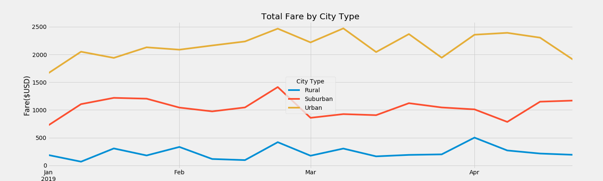

# PyBer_Analysis
UofT Data Analytics Boot Camp Module 05

## Project Overview
Objective
* To provide the analysis of Ride-Sharing Services for different city

Data:
* List of City with Number of drivers (Resources/city_data.csv)
* Details of each ride (Resources/ride_data.csv)

Software: Python 3.7.6, JupyterLab

## Outcome
#### 1. Summary by Type of City

#### 2. Fares by Type of City Overtime
